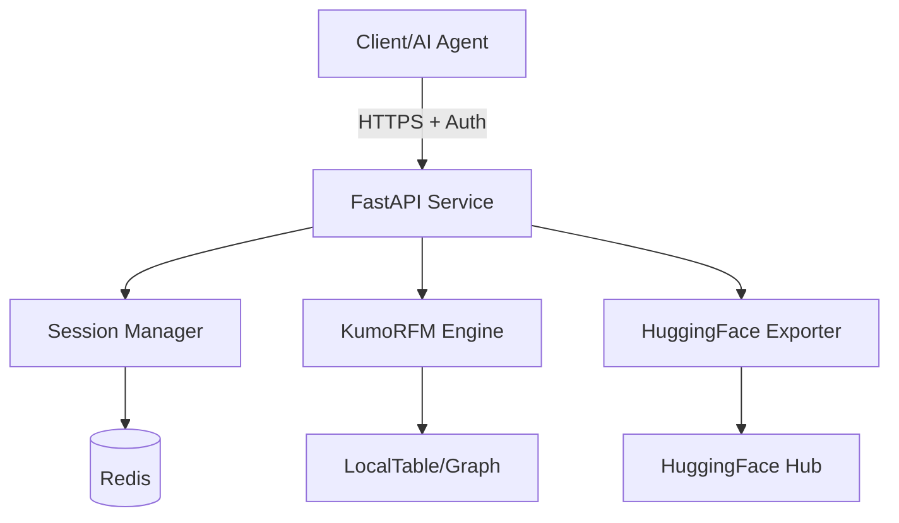

# Dataset Director

[](https://www.python.org/downloads/)
[](https://fastapi.tiangolo.com)
[](https://opensource.org/licenses/MIT)
[](https://fly.io)

A production-ready FastAPI microservice for AI-powered dataset curation, featuring Kumo SDK (KumoRFM) integration and HuggingFace Hub export capabilities. Perfect for building high-quality training datasets with AI assistance.

## Features

- **FastAPI Framework** - High-performance async API with automatic OpenAPI documentation
- **KumoRFM Integration** - Leverage Kumo's Foundation Model for intelligent predictions
- **HuggingFace Export** - Seamlessly export curated datasets to HuggingFace Hub
- **Secure by Default** - API key authentication, rate limiting, and security headers
- **Session Management** - Redis-backed persistent sessions with TTL
- **Flexible Data Input** - Support for CSV, JSON, and multipart uploads
- **Smart Validation** - Gracefully handles unknown classes without failing
- **Docker Ready** - Production-optimized Dockerfile with multi-stage builds
- **Comprehensive Test Suite** - Full test coverage with 30+ unit tests
- **Complete API Documentation** - Detailed API specifications in `API.md`

## Architecture



## Quick Start

### Prerequisites

- Python 3.11+
- Redis (optional, for persistent sessions)
- Docker (for containerized deployment)

### Local Development

1. **Clone the repository**
```bash
git clone https://github.com/yourusername/dataset-director.git
cd dataset-director
```

2. **Create virtual environment**
```bash
python -m venv venv
source venv/bin/activate  # On Windows: venv\Scripts\activate
```

3. **Install dependencies**
```bash
pip install -r requirements.txt
pip install -r requirements-dev.txt  # For development
```

4. **Set up environment variables**
```bash
cp .env.example .env
# Edit .env with your API keys:
# - API_KEY: Your service authentication key
# - KUMO_API_KEY: KumoRFM API key
# - HF_TOKEN: HuggingFace token
```

5. **Run the service**
```bash
uvicorn app.main:app --reload --port 8080
```

6. **Visit API documentation**
```
http://localhost:8080/docs
```

### Running Tests

The project includes a comprehensive test suite with 30+ unit tests covering all endpoints and core functionality:

```bash
# Run all tests
pytest tests/ -v

# Run with coverage report
pytest tests/ --cov=app --cov-report=html

# Run specific test file
pytest tests/test_basic.py -v
```

## API Documentation

Complete API documentation is available in [`API.md`](./API.md), including:
- All endpoint specifications
- Request/response schemas
- Authentication details
- Rate limiting information
- Integration examples

### Authentication
All endpoints (except `/health`) require Bearer token authentication:
```http
Authorization: Bearer YOUR_API_KEY
```

### Core Endpoints

#### 1. Initialize Session
```http
POST /session/init
Content-Type: application/json

{
  "classes": ["positive", "negative"],
  "target_count_per_class": 50,
  "styles": ["formal", "casual"],
  "include_negations": false
}
```

#### 2. Upload Seed Data (JSON)
```http
POST /session/seed_upload_json
Content-Type: application/json

{
  "session_id": "session_abc123",
  "rows": [
    {
      "text": "This product is amazing!",
      "class": "positive",
      "style": "casual",
      "negation": false
    }
  ]
}
```

#### 3. Get Coverage Predictions
```http
GET /plan/coverage?session_id=session_abc123
```

#### 4. Get Next Specs
```http
GET /plan/specs?session_id=session_abc123&class_name=positive
```

Response:
```json
{
  "spec_ids": ["positive|formal|0", "positive|casual|0"],
  "spec_predictions": {
    "positive|formal|0": 2,
    "positive|casual|0": 0
  }
}
```

Notes:
- `spec_predictions` may be omitted when predictions are unavailable. Clients should fallback to session spec order.

#### 5. Export to HuggingFace
```http
POST /export/hf
Content-Type: application/json

{
  "session_id": "session_abc123",
  "repo_id": "my-awesome-dataset"
}
```

## Docker Deployment

### Build locally
```bash
docker build -t dataset-director .
```

### Run with Docker
```bash
docker run -p 8080:8080 \
  --env-file .env \
  -e CORS_ORIGINS="https://yourdomain.com" \
  dataset-director
```

## Deploy to Fly.io (Recommended)

We recommend deploying to Fly.io for its simplicity and excellent support for FastAPI applications. Fly.io provides:
- Automatic SSL certificates
- Global edge deployment
- Built-in health checks
- Simple secrets management
- Free tier available

### Deployment Steps

1. **Install Fly CLI**
```bash
curl -L https://fly.io/install.sh | sh
```

2. **Login to Fly**
```bash
fly auth login
```

3. **Create app**
```bash
fly apps create your-app-name
```

4. **Set secrets**
```bash
./deploy_secrets.sh  # Uses your .env file
```

5. **Deploy**
```bash
fly deploy --app your-app-name
```

Your service will be available at `https://your-app-name.fly.dev`

## Configuration

### Environment Variables

| Variable | Description | Required | Default |
|----------|-------------|----------|---------|
| `API_KEY` | Service authentication key | Yes | - |
| `KUMO_API_KEY` | KumoRFM API key | Yes | - |
| `HF_TOKEN` | HuggingFace Hub token | Yes | - |
| `REDIS_URL` | Redis connection URL | No | In-memory |
| `CORS_ORIGINS` | Allowed CORS origins | No | `*` |
| `SESSION_TTL` | Session TTL in seconds | No | `1800` |
| `LOG_LEVEL` | Logging level | No | `INFO` |
| `ENCRYPTION_KEY` | Fernet key for encryption | No | - |

### Rate Limits

- Session initialization: 10/min
- Data uploads: 20/min
- Planning queries: 30/min
- HuggingFace exports: 5/min

## Known Issues

### Pydantic Version Compatibility
The service requires **Pydantic v1.10.x** due to KumoAI SDK dependencies. While FastAPI 0.115.0 typically uses Pydantic v2, it maintains backward compatibility with v1. The requirements are pinned to specific versions to ensure compatibility:
- `pydantic==1.10.22`
- `fastapi==0.115.0`
- `kumoai==2.6.0`

### KumoRFM vs Kumo Enterprise
This service uses **KumoRFM** (Kumo's Foundation Model), not the enterprise Kumo platform. Key differences:
- KumoRFM uses in-memory `LocalTable` and `LocalGraph` objects
- No cloud table uploads are performed
- The API key format and endpoints differ from enterprise Kumo
- RFM is optimized for smaller datasets and real-time predictions

### Temporal Window Requirements
- Short-horizon predictions (e.g., 10 minutes) require a history window. The service spreads `samples.ts` over the last hour to satisfy this window. If predictions are not available, endpoints return 200 with fallback values and the UI uses safe defaults.

### Architecture Compatibility
KumoRFM currently supports:
- **Linux x86_64** (production deployments)
- **macOS ARM64** (Apple Silicon for development)
- **Windows x86_64**

Not supported:
- Linux ARM64 (Docker on Apple Silicon will fail locally but works on x86_64 deployment platforms)

## Production Considerations

### Security
- API key authentication
- Rate limiting per endpoint
- Input sanitization
- Security headers (CSP, HSTS, etc.)
- CORS configuration

### Scalability
- Stateless design (Redis for session storage)
- Horizontal scaling ready
- Connection pooling for Redis
- Async request handling

### Monitoring
- Health check endpoint (`/health`)
- Structured logging
- Request ID tracking
- Error reporting

## Contributing

We welcome contributions! Please see [CONTRIBUTING.md](./CONTRIBUTING.md) for details.

1. Fork the repository
2. Create your feature branch (`git checkout -b feature/amazing-feature`)
3. Commit your changes (`git commit -m 'Add amazing feature'`)
4. Push to the branch (`git push origin feature/amazing-feature`)
5. Open a Pull Request

## License

This project is licensed under the MIT License - see the [LICENSE](./LICENSE) file for details.

## Acknowledgments

- [FastAPI](https://fastapi.tiangolo.com/) - Modern web framework
- [Kumo AI](https://kumo.ai/) - KumoRFM Foundation Model
- [HuggingFace](https://huggingface.co/) - Dataset hosting platform
- [Fly.io](https://fly.io/) - Edge deployment platform

## Support

- Issues: [GitHub Issues](https://github.com/yourusername/dataset-director/issues)
- Documentation: [API.md](./API.md)
- Contributing: [CONTRIBUTING.md](./CONTRIBUTING.md)

---

Built with care for the AI community